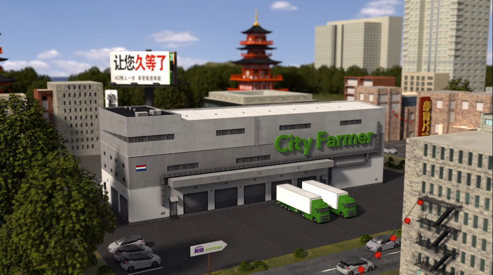

Animatie is dé marketingtool van onze tijd. Maar welk type animatie past nou echt bij jouw bedrijf en verhaal? Er zijn allerlei soorten en stijlen animaties. Het grootste onderscheid is het verschil tussen 2D en 3D beeld. In dit artikel leggen wij uit wat het verschil is en waarom je toch écht voor 2D of 3D zou moeten kiezen. 

## 2D animatie

De meeste animaties die geproduceerd worden zijn 2-dimensionaal. Al meer dan 100 jaar worden animaties in 2D stijl gemaakt. Waar deze 100 jaar geleden met de hand getekend werden, gebeurt dit tegenwoordig veelal met de computer. Dit geeft meer mogelijkheden en maakt animeren goedkoper en steeds toegankelijker. Een 2D animatie is vaak simpeler om te produceren dan een 3D animatie. [2D animaties](https://www.philenflo.nl/2d-animatie/) zijn dan vaak goedkoper. Daarnaast ligt de productietijd vaak lager dan bij een 3D animatie. 

2D animaties zijn heel geschikt voor het uitleggen van een dienstverlening of een abstract concept. Je kan dan het beeld gebruiken om de uitleg van je dienst of concept te ondersteunen. Denk aan het visualiseren van opsommingen en samenhang tussen onderdelen. Ook producten kun je goed uitleggen en tonen middels 2D animatie.

Houdt hierbij wel rekening met de limitaties van platte tekeningen. Binnen 2D animatie zijn er tal van stijlen mogelijk. Dit is een kwestie van smaak. Als je niet zeker weet wat je wilt, zoek dan veel animaties op Youtube of Vimeo om er zo achter te komen wat jij mooi vindt. Uiteraard kunnen animatoren of productiebedrijven je vaak ook gedegen advies geven.

## 3D animatie

Het grootste voordeel van [3-dimensionale animaties](https://www.philenflo.nl/3d-animatie-laten-maken/) is de mogelijkheid om fotorealistisch beeld te creëren. Je kunt het kleinste detail laten terugkomen in je animatie, maar bent niet gebonden aan natuurwetten. Dit is een groot verschil met bijvoorbeeld een echte film. Je kan je creativiteit dus de vrije loop laten. 

Als je net die extra stap wilt zetten om je te onderscheiden van je concurrentie, dan is 3D animatie zeker het overwegen waard. Hieronder lees je interessante feitjes die je wellicht inspireren om te kiezen voor een 3D animatie.

### Mogelijkheden van 3D animatie voor game industrie

In principe bouwt een 3D animator een kleine virtuele wereld op en filmt hierbinnen jouw animatie. Dit zorgt ervoor dat je in je animatie alle kanten op kan qua filmhoeken. Je hoeft dan een scène niet steeds opnieuw op te bouwen, maar je kunt binnen de reeds gecreëerde “filmset” andere camerahoeken kiezen. 

Deze manier van werken wordt ook veel toegepast in het ontwerpen van computer games, een industrie ten waarde van maar liefst 300 miljard dollar.* De groei en snelle ontwikkeling die de gamebranche doorgaat zorgt ervoor dat ook 3D animaties steeds mooier, gedetailleerder en uitgebreider kunnen worden gemaakt. 

### CAD tekeningen maken met animatie 

Veel bedrijven die producten of machines produceren hebben technische tekeningen zoals CAD tekeningen. Deze tekeningen zijn vaak te verwerken in een animatie. Een animator kan deze dan tot leven brengen. Zo kan je tot op detail de werkzaamheid van een machine of product weergeven.

### Virtual Reality

Virtual Reality lijkt misschien een mediavorm die ver weg staat van animatie, maar niks is minder waar. Zoals benoemd speelt de game-industrie hierin een grote rol. Afhankelijk van hoe je een 3D animatie opbouwt kan je het framework hiervan gebruiken om een VR film te maken. Kies je dus voor 3D animatie, dan is een [virtual reality animatie](https://www.philenflo.nl/vr-animatie-laten-maken/) binnen handbereik.

### Blended animatie

Je hoeft natuurlijk niet te kiezen tussen 2D of 3D, maar kan deze ook combineren. Binnen een 3D animatie kan je natuurlijk 2D elementen laten terugkomen. Zo heeft [ons team voor Boknet een animatie gemaakt waarin beeldende kunst centraal staat](https://www.philenflo.nl/portfolio/boknet-3d-animatie-beroeps-organisatie-kunstenaars/). In 3D hebben we een ruimte gebouwd waarin van alles te zien is, waaronder 2D kunst aan de muren. Animatie is een blijft een creatief medium, dus laat je niet belemmeren door bestaande structuren, maar denk vooral na over wat jouw ideaalplaatje zou zijn. De experts kunnen dan meedenken in wat er wel of niet mogelijk is op technisch vlak.

### Marketing doelstellingen

De keuze voor een type animatie kan impact hebben op de uitstraling van jouw organisatie. Staat jouw bedrijf bijvoorbeeld voor exclusiviteit en innovatie? Dan zal de keuze voor een 3D animatie dit verder onderschrijven. Helemaal als jouw concurrenten zich fixeren op 2D animatie. Dus neem ook zeker de status van jouw branche, product en marketing doelstellingen mee in het maken van een keuze. Ik zelf werk bij Phil & Flo en kan samen met mijn collega’s vrijblijvend met je meedenken over hoe [animatie](https://www.philenflo.nl/oplossingen/animatie-laten-maken/) kan bijdragen aan het behalen van jullie doelstellingen.

Wil jij meer weten over 2D- en 3D animatie? Plan nu een vrijblijvende 30 minuten sessie met onze animatiespecialist.

\* <https://newsroom.accenture.com/news/global-gaming-industry-value-now-exceeds-300-billion-new-accenture-report-finds.htm>