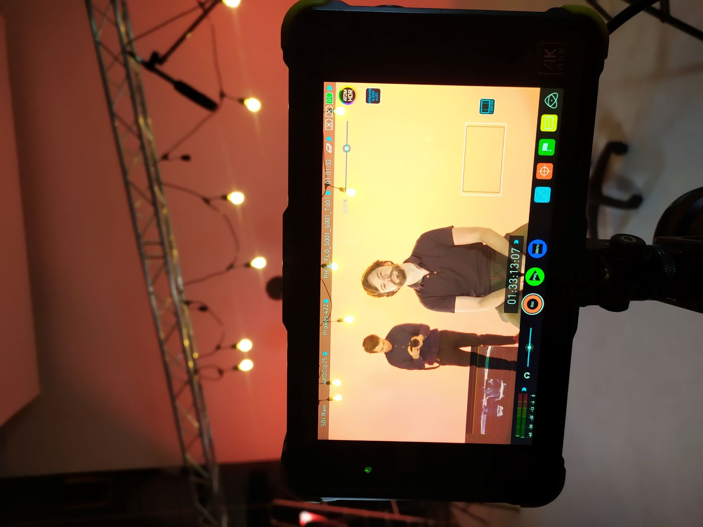

Wat betekent het nu als je een bedrijfsfilm laat maken van A tot Z? Om hier antwoord op te geven, gaan we in deze blog stapsgewijs door de fasen heen die je doorloopt bij het maken van een film, in specifieke zin een bedrijfsfilm, ook wel corporate film genoemd. Uiteraard zijn deze fasen richtlijnen, maar afhankelijk van jouw specifieke situatie en wensen zal je de meeste fasen doorlopen of al doorlopen zijn.

Elke creatieve productie start met een idee of wens. Vervolgens kan je op zoek gaan naar een partij die jou kan helpen om deze film van A tot Z te realiseren. [Het maken van een bedrijfsfilm](https://www.philenflo.nl/bedrijfsfilm-laten-maken/) vraagt veel vakspecifieke kennis, het is daarom aan te raden een gedegen partner te vinden die jouw creatieve idee verder ontplooit en uitvoert. Samen met de specialist stel je technische kaders op om de doelen, tijdsframe en kosten van het project scherp te krijgen. Zodra dit rond is, is het tijd voor de creatieve invulling!

## Creatieve sessie voor een bedrijfsfilm

Tijdens een creatieve sessie bespreek je met enkele betrokkenen de ideeën en wensen voor jouw bedrijfsfilm. Een belangrijke keuze is of je werknemers aan het woord wilt laten middels interviews, of liever een professionele stemacteur inzet om je verhaal over te brengen. Vaak bekijk je op voorhand of tijdens de sessie inspirerende voorbeelden die je met het team bespreekt, maar ook bespreek je wat voor stem het beste jouw verhaal kan vertellen, ideeën voor specifieke scènes, en kernwoorden die je belangrijk vindt om in het script of interview terug te zien. Als je samenwerkt met een professionele partij, dan zullen zij jou de juiste vragen stellen om te komen tot de kern van jouw bedrijfsfilm.

## Draaiboek voor een corporate film

Met alle input gaat een ervaren scriptschrijver aan de slag om jouw wensen te vertalen in een bondig, pakkend verhaal. Indien er interviews worden afgenomen dan worden de vragen aan de hand van de verzamelde input silm geformuleerd. Bij het maken van het script of de interviewvragen wordt al rekening gehouden met het beeld. Je vertelt je verhaal namelijk op twee manieren. Via beeld en via gesproken woord. Een goede samenhang tussen deze twee is van belang. Een draaiboek bevat daarom niet alleen het script of de interview vragen, maar ook een planning van welke beelden waar en met wie geschoten worden. Zodra de eerste versie van het draaiboek af is, kan jij feedback geven. Zo kom je samen tot een definitief draaiboek voor jouw corporate film.

## Voorbereiding draaidag

Een filmexpert, zoals bijvoorbeeld Phil & Flo, helpt je om de draaidag zo goed als mogelijk voor te bereiden. De filmlocaties zijn opgeruimd, en de betrokkenen weten wie waar en wanneer moet zijn. Een goede voorbereiding bespaart veel tijd. Zo haal je het maximale uit een draaidag.

## Draaidag van de bedrijfsfilm

De draaidag wordt door onze klanten vaak als een spannende maar leuke dag ervaren. Alles is gepland en voorbereid. De filmcrew schiet volgens planning de benodigde shots en neemt de interviews af. Om goed te interviewen, maken wij gebruik van allerlei slimme trucjes om jou op je gemak te laten voelen, en op die manier zulk spontaan en goed mogelijke antwoorden te krijgen. Als de draaidag erop zit, is het tijd voor de montage.

## Montage van de bedrijfsfilm

Een ervaren editor monteert jouw film aan de hand van het goed gekeurde draaiboek. De beste shots en interviewantwoorden gekozen. Alles met het doel van de film in acht genomen. Een uitgebreide kleuren- en audio correctie zorgt ervoor dat jouw 4K bedrijfsfilm lang en duurzaam inzetbaar is. Uiteraard kan je feedback geven op de gemonteerde film. Zo kom je samen met de experts tot het beste resultaat.

## Succes boeken met een corporate film

Een corporate film effectief inzetten vraagt om een goed contentplan waarin je je films, animaties en andere content gefaseerd deelt met je publiek. Vaak geeft jouw contactpersoon hier gedegen advies over. Denk aan het inrichten van je socialmediakanalen, het ontwerpen van flyers met een qr-code of een teaserversie van je bedrijfsfilm. Met laatstgenoemde kan je effectief adverteren op bijvoorbeeld Linkedin en [Youtube](https://www.philenflo.nl/youtube-marketing/). Afhankelijk van wat jouw doelen zijn vind je samen met de experts de juiste tools om succes te boeken!

Dus wat betekent het om een bedrijfsfilm van A tot Z te laten maken? Eigenlijk wordt je geheel ontzorgd en hoef je alleen feedback of goedkeuring te geven op de gemaakte opzetten en producten die ervaren specialisten jou voorschotelen. Wil je meer weten over onze type films? Lees dan hier meer over [corporate video's](https://www.philenflo.nl/corporate-video/) of bekijk ons [portfolio](https://www.philenflo.nl/portfolio/)!