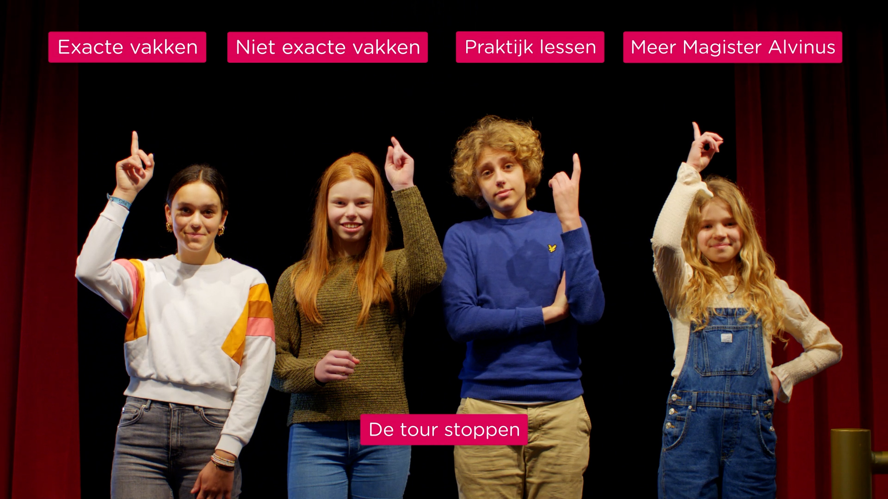
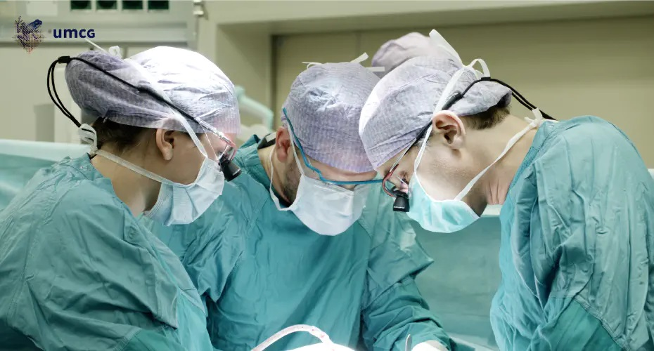

Een 360 graden video - of immersive video - is een uitgeklede vorm van virtual reality: Het biedt een vergelijkbare ervaring, maar dan zonder extra hardware en het is gewoon te bekijken op je smartphone. 

Heb jij al nagedacht over hoe je dit in kunt zetten? In dit blog leggen we uit waarom het verstandig is om hier toch eens over na te denken.

## Wat is 360 graden video?

Een 360 graden video is een video waarbij de kijker tijdens het bekijken zelf de camera kan draaien en zo alle kanten op kan kijken. Dit kan door met een speciale camera een bepaalde scene vanuit alle richtingen tegelijk te filmen.

## Voordelen en mogelijkheden van 360 graden video's

360 graden video's brengen een aantal voordelen met zich mee:

### Beleving en interactiviteit

Video is in vergelijking met andere vormen van content al een krachtig middel om meeslepende belevingen te creëren. 360 graden video doet hier nog een schepje bovenop. Door een 360 graden video te bekijken dompel je jezelf onder in een (iets) andere wereld en ben je regisseur, hoofdrolspeler en kijker tegelijk.

Het beste werkt dit op een smartphone. Door de telefoon te draaien bepaal jezelf wat je ziet. En gebruik je hierbij een cardboard dan merk je dit nog sneller. Draai je hoofd en het beeld beweegt meteen mee, de 3D-weergave (met aparte beelden voor beide ogen) versterkt die ervaring nog eens.

Dit alles zorgt voor een verhoogd niveau van beleving. Situaties gaan sneller als echt aanvoelen en dat roept emoties op. Daardoor leef je je als kijker in en onthoud je de ervaringen die je opdoet tijdens het kijken beter. Het is die combinatie van beleving en leren die 360 graden video interessant maakt, voor bedrijven, maar ook als educatief middel voor het onderwijs of bedrijfstrainingen.

### Nieuwe vormen van storytelling

De basis van vrijwel elke vorm van video is een verhaal. In 'gewone' video vertel je dit in een lineaire vorm: de gebeurtenissen spelen zich af in een logische volgorde die voor iedereen gelijk is. Bij 360 graden video verandert de vorm van het verhaal van lineair in non-lineair. Er zijn meerdere verhaallijnen mogelijk omdat de kijker het perspectief bepaalt en het verhaal zelf vormgeeft. En dat kan elke keer weer anders zijn.

### Geen hardware nodig

In tegenstelling tot volledige [Virtual Reality](https://www.philenflo.nl/oplossingen/virtual-reality/), heeft de kijker niks extras nodig. Op bijna elk device of platform kun je een 360 graden video bekijken wat het aantrekkelijker maakt voor bedrijven om in te investeren.



## Toepassingen van 360 graden video

Er zijn veel manieren om 360 graden video te gebruiken. Bekende en minder bekende. Nuttige en minder nuttige. Maar in alle gevallen zorgt de verhoogde beleving en de realistische beelden voor meerwaarde ten opzichte van gewone video.

### Experience

Wanneer 360 graden video's onderdeel zijn van [marketing campagnes](https://www.philenflo.nl/oplossingen/videomarketing/) ligt vaak de nadruk gelegd op beleving. Zo kunnen kijkers kennis laten maken met unieke ervaringen die ze anders nooit mee zouden kunnen maken of plekken bezoeken die tot de verbeelding spreken.

Denk ook aan [virtual tours](https://www.philenflo.nl/virtuele-tour/). Soms zo simpel als de 360 graden tours die iedereen wel kent van Funda, maar soms als manier om mensen kennis te laten maken met je kantoor. Of om in te zetten bij de onboarding van nieuwe medewerkers of om op afstand een museum te bezoeken. 

### Bedrijfstrainingen en educatieve toepassingen

360 graden video heeft ten opzichte van bestaande onderwijsmiddelen een aantal didactische voordelen. 

• **Onopvallend aanwezig zijn**: Je kunt overal rondkijken zonder dat je storend aanwezig bent. 

• **Moeilijke situaties in beeld brengen**: Je kunt virtueel plekken bezoeken die normaal gesproken moeilijk te bereiken zijn en zo situaties meebeleven die gevaarlijk of kostbaar zijn om na te bootsen.

• **Leren van experts**: Meekijken terwijl experts een bepaalde handeling uitvoeren is zeer leerzaam. 

• **Zelf het perspectief bepalen**: Bij een normale video stuurt de camera je blik, maar bij 360 graden video bepaal iemand zelf het perspectief, en daarmee de leerervaring.

• **Herhaling**: Dezelfde leersituatie kan meerdere malen worden bekeken en iedere keer vanuit een ander perspectief. 

• **Leren gaat sneller**: De kijker onthoudt informatie beter waardoor het leren sneller gaat.

• **Tijd en geld besparen**: Een 360 graden video is financieel interessant in vergelijking met andere vormen van trainingen: een video neem je één keer op en wordt daarna hergebruikt. Een training geef je steeds opnieuw en iedereen moet ervoor op locatie aanwezig zijn.

### Zorg

De zorg is naast het onderwijs een voorbeeld van een bedrijfstak waar VR en in mindere mate 360 graden video een enorme impact heeft.

De meest tot de verbeelding sprekende toepassingen binnen de zorg zijn 360 graden beelden vanuit de operatiekamer als ondersteuning van de opleiding van artsen en chirurgen. Minstens zo nuttige toepassingen zijn videos die mensen voorbereiden op een behandeling door uit te leggen wat patiënten kunnen verwachten. Of video's die kunnen worden gebruikt om begrip te kweken bij naasten door de beleving van iemand die door het leven gaat met dementie of bijvoorbeeld een psychose na te bootsen. En 360 graden videos zijn nuttig bij de behandeling van een angststoornis, bijvoorbeeld als onderdeel van exposuretherapie waarin mensen langzaam worden blootgesteld aan de bron van de angststoornis of nare herinneringen.

## Meer weten over 360 graden video?

Omdat 360 graden video een relatief nieuwe ontwikkeling is zijn de mogelijkheden nog lang niet uitgeput. Dus ben je geïnteresseerd geraakt in de mogelijkheden of wil je een keertje brainstormen? Plan dan een sessie in met één van onze specialisten.