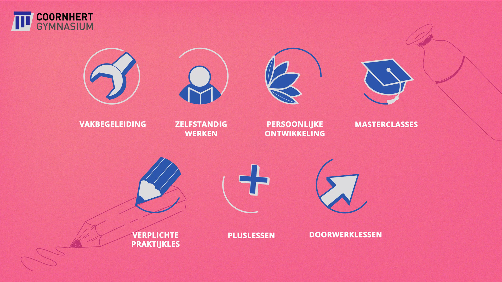

Waarom zou je als onderwijsinstelling kiezen voor animatie? Deze vraag kent een uitgebreid antwoord die je in deze blog kunt lezen. Dat animatie een steeds grotere rol speelt in de didactiek is in ieder geval iets wat als een paal boven water staat.

Als we kijken naar het [onderwijs ](https://www.philenflo.nl/branches/onderwijs-kunst-cultuur/)dan zien we enkele belangrijke trends waar het gebruik van animatie een bijdrage aan kan leveren. Denk bijvoorbeeld aan de digitalisering van het onderwijs, maar ook aan het drukkende personeelstekort. Om goed uit te leggen wat animatie kan betekenen voor het onderwijs is het slim om eerst toe te lichten wat een animatie precies is.

## Wat is animatie?

Een [animatie](https://www.philenflo.nl/oplossingen/animatie-laten-maken/) is een combinatie van getekend beeld en gesproken woord. Dit getekende beeld kan met zowel een computer als met de hand gemaakt zijn. Vaak zijn animaties voor commerciële doeleinden kort en krachtig en veelal rond de één minuut lang. Terwijl animaties al jarenlang populair zijn onder kinderen, in de vorm van tv-series (cartoons), is animatie tegenwoordig een breed in te zetten tool die door allerlei bedrijven en instellingen aangegrepen wordt om hun producten en diensten uit te leggen. 

Ook in het onderwijs maakt de animatie en andere videocontent een opmars. [2D animatie](https://www.philenflo.nl/2d-animatie/) is de meest voorkomende vorm, maar ook [3D](https://www.philenflo.nl/3-d-animatie-laten-maken/) wint aan terrein dankzij de prachtige, realistische weergaven die mogelijk zijn. Afhankelijk van wat jij wilt uitleggen of promoten kan het zijn dat 3D net iets meer realisme en detail biedt die jij nodig hebt om je doelstelling te bereiken.

## Waarom animatie gebruiken in het onderwijs?

De combinatie van beeld en geluid zorgt ervoor dat de boodschap beter blijft hangen bij de kijker. Door het bewegende beeld in een animatie kan je complexe begrippen en vraagstukken visualiseren en begrijpbaar maken. Denk bijvoorbeeld aan een abstracte wiskundige opgave, zoals de stelling van pythagoras, maar ook aan instructies voor een opdracht of project die je in animatievorm kan verduidelijken.

Afgelopen jaar heeft ons team van Phil & Flo onder andere een [uitleganimatie](https://www.philenflo.nl/uitleganimatie-laten-maken/) gemaakt om een nieuwe keuzerooster voor een middelbare school uit te leggen. Vaak als je je animatie goed inricht kan deze meerdere doelgroepen dienen, bijvoorbeeld kinderen, ouders maar ook docenten.

## Hoe pas ik explanimations toe in mijn lespakket?

Een [explanimation](https://www.philenflo.nl/explanimation-laten-maken/) is eigenlijk hetzelfde als een uitleganimatie. Wanneer je animatie toevoegt aan je lespakket, dan is het belangrijk dat deze goed aansluiten op het bestaande lesmateriaal. Het is aan te raden om lesmateriaal niet per se te vervangen door animatie maar vooral om deze aan te vullen met lesanimaties. Bijvoorbeeld voor een wiskundig hoofdstuk dat over de pythagorasstelling gaat. Op een speelse manier kan je interactieve opgaven in animatievorm maken. 

Door goed gebruik van pauzes in een animatie, blijft de stof niet alleen beter hangen bij de leerlingen, maar geeft de animatie ook ruimte voor een vraag-en-antwoordspel. De rol van de docent blijft hierin natuurlijk essentieel. Als docent kan je inspelen op vragen die ontstaan naar aanleiding van de animatie en eventuele onduidelijkheden verder klassikaal behandelen.

## Onderwijstrends in animatie

Als het gaat om het digitaliseren van ons onderwijs, dan is er zeker een rol weggelegd voor [videocontent](https://www.philenflo.nl/oplossingen/video-laten-maken/) en in specifieke zin animatie. Door lesstof aan te vullen met deze (interactieve) content wordt het lespakket diverser, speelser en spannender, maar ondersteun je ook de docent. 

De werkdruk voor een docent neemt af wanneer men gebruik kan maken van animaties in het lespakket. De animatie pakt de aandacht van de leerlingen, instrueert de leerlingen op een nieuwe manier, en legt een basis voor een klassikale bespreking. Dit maakt de lessen leuker voor zowel de docent als de leerlingen. En nee, dit lost niet het personeelstekort op in het onderwijs, maar wij geloven zeker dat het bij kan dragen aan betere arbeidsomstandigheden en daarmee het docentenvak een nieuw leven in kan blazen.

Wil jij meer weten over de toepassing van animatie in het onderwijs? Plan nu een vrijblijvende 30 minuten sessie met onze onderwijs specialist. 

Lees hier meer over onze unieke interactieve [virtuele school rondleidingen](https://www.philenflo.nl/virtuele-school-rondleiding/).