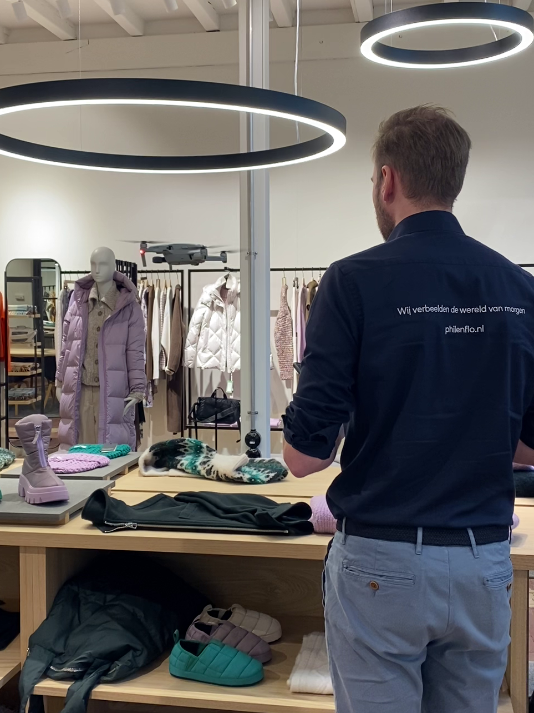
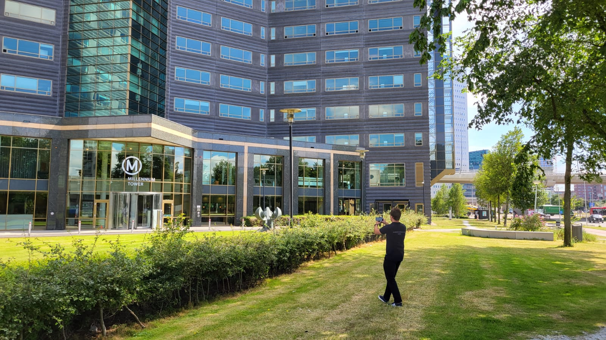

Een unieke [video laten maken](https://www.philenflo.nl/oplossingen/video-laten-maken/) voor jouw bedrijf? Je kunt natuurlijk gaan voor een ‘standaard’ video, maar je kunt het een stuk aantrekkelijker maken door een drone film te laten maken. Er zijn verschillende redenen om te kiezen voor drone beelden in jouw video. Je leest er alles over in dit blog. 

## Welke soorten drone opnames zijn er?

Met een drone kun je vanuit veel verschillende standpunten filmen. Zo vlieg je met een drone over bijvoorbeeld jouw pand, bedrijf, terrein, landgoed of evenement. Maar ook binnen kan met een drone gevlogen worden, om bijvoorbeeld productieprocessen of andere werkzaamheden vast te leggen op een unieke manier. 

## Hoe maak je een drone video?

Een drone video wordt gemaakt door een op afstand bestuurbaar vaartuig met een ingebouwde camera. Met de drone kunnen verschillende soorten beelden gemaakt worden. Denk aan vloeiende beelden, slow-motion shots of bewegende shots die voertuigen of mensen volgen. Dit maakt dat een drone video geschikt is voor veel soorten [branches](https://www.philenflo.nl/branches/). De beelden die worden gemaakt met de drone, worden daarna gemonteerd samen met beelden vanaf de grond gemaakt. Door deze mix van beelden, laat je met de drone beelden de zintuigen van de kijker op scherp zetten en creëer je een spectaculaire video. 

## Redenen voor het maken van een drone video

Een drone maakt vanaf grote hoogte spectaculaire beelden die meteen de aandacht van de kijker trekken. De drone legt beelden vanuit een uniek standpunt vast die de mens niet dagelijks ziet. Droneshots worden daarom nog altijd als luxe toevoeging aan je video gezien. Een omgeving vanuit de lucht zie je vaak alleen vanuit een vliegtuig of een hoog gebouw. Niet alledaags dus en daarom geven dronebeelden een luxe, professionele touch aan je video. 

## Maak een drone video met Phil & Flo

Via Phil & Flo kun je een spectaculaire [drone video laten maken](https://www.philenflo.nl/drone-video-laten-maken/). Onze drone specialisten hebben alle nodige diploma’s en brevetten om volgens de actuele dronewetgeving te vliegen. En ook niet onbelangrijk, het creatief talent en de technische ‘know hows’ zijn aanwezig. Een samenwerking met een Phil & Flo start altijd met een intake en daarop volgend een creatieve sessie. Met alle ideeën hieruit, maakt ons creatieve team een script en draaiboek. Het is vaak mogelijk om in slechts één dag alle beelden te schieten. Met de drone shots én shots vanaf de grond, maken wij pakkende drone video’s die jouw boodschap bij de kijker overbrengt.