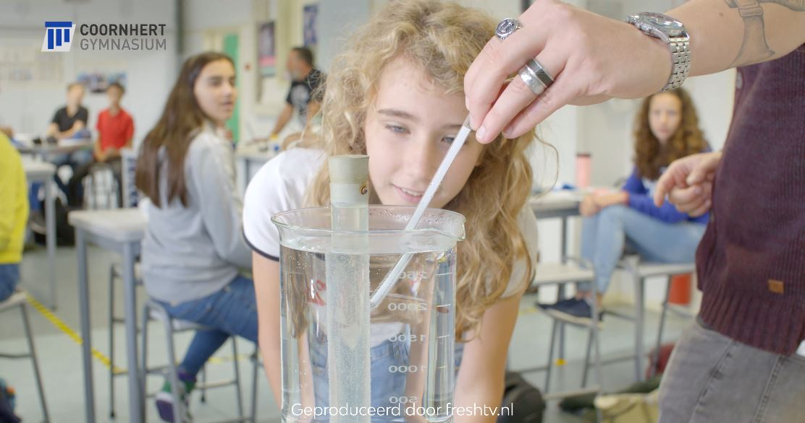

Ze zijn overal. Iedereen heeft er een, en iedereen houdt er van: een goed verhaal. 
Met een goed verhaal verbind je mensen en speel je in op emoties. Daarom zijn verhalen een uitstekende manier om informatie over te brengen: om je bedrijf in de etalage te zetten, merkbeleving te creëren of betrokkenheid op te wekken bij een bepaalde doelgroep.

In dit artikel gaan we dieper in op storytelling, waarom het zo effectief is en bekijken we een aantal inspirerende voorbeelden.

## Wat is storytelling?

Storytelling is geen nieuwe uitvinding. Mensen vertellen elkaar al duizenden jaren verhalen. In de vorm van geschreven tekst of als doorgefluisterde geheimen die van generatie op generatie worden doorverteld. 

Want dat is waar storytelling op neerkomt. Het vertellen van een verhaal. Maar er komt nog wel iets meer bij kijken. In de wereld van [(video) marketing](https://www.philenflo.nl/oplossingen/videomarketing/) gaat het om het vertellen van verhalen met een doel. Namelijk om klanten een persoonlijke of emotionele connectie te laten voelen met jouw bedrijf of merk en ze hierbij zodanig te inspireren dat ze jouw product willen kopen.

Het belangrijkste ingrediënt is een verhaal dat goed in elkaar zit. Door dit in beeld te brengen en daarbij gebruik te maken van filmische technieken waarbij gespeeld wordt met tempo, ritme, suspension, soundeffects, muziek en stemgeluid roep je sferen en emoties op en zorg je voor beleving en verbinding.

## Waarom is storytelling zo effectief?

Een groot gedeelte van de mensen zijn visueel ingesteld en onthouden informatie het best wanneer het op een visuele manier wordt gebracht. En belangrijker, ons brein is gemaakt voor verhalen. Een goed verhaal spreekt verschillende onderdelen van de hersenen aan. Ten eerste het beloningssysteem. Dat zorgt ervoor dat als je een video bekijkt of het begin van een verhaal hoort je per se wilt weten hoe het afloopt. Of dat je meer wilt kijken wanneer de [video](https://www.philenflo.nl/oplossingen/video-laten-maken/) afgelopen is. 

Daarnaast speelt het gedeelte van de hersenen dat emoties reguleert een belangrijke rol. Tijdens het kijken van een storytelling video kun je makkelijk emotioneel betrokken voelen. Dit komt door het emotionele centrum in ons brein. Hier worden emoties verwerkt en komen stoffen vrij waardoor we ons na het kijken gelukkig, angstig, geïnspireerd, verdrietig, opgelucht of geïnspireerd voelen. Kortom: dat we ons kunnen inleven in het verhaal.

Dan is er nog het hersengedeelte dat informatie verwerkt. De emoties in een verhaal maar ook de structuur van een verhaal heeft impact op de manier hoe onze hersenen makkelijker informatie kunnen verwerken en opslaan. Al deze combinaties bij elkaar maken van storytelling een effectieve manier om mensen te verleiden, mee te nemen en in actie te laten komen.

## Inspirerende voorbeelden van storytelling video's

Hier zijn een paar voorbeelden van video's waarin storytelling een belangrijk onderdeel is.

### National Geographic

National Geographic is een voorbeeld van een bedrijf dat zo'n beetje is gebouwd rondom storytelling. Sinds 1888 vertellen ze verhalen over wetenschap en natuur. Vroeger alleen in een magazine, nu worden verschillende kanalen ingezet om allerlei inspirerende verhalen te delen. Blogs, verschillende social media, longreads en ook vooral video.

### RedBull

RedBull is een voorbeeld van een bedrijf dat video marketing heel serieus neemt. En met een YouTube kanaal met meer dan 10 miljoen abonnees met recht een grote speler te noemen is. 

Met regelmaat maken ze epische video's waaraan je duidelijk kunt zien dat ze zijn geïnspireerd door speelfilms. Zoals deze video die uitblinkt in zijn montage waarin het gebruik van achtergrondmuziek en soundeffects prominent zijn.



### Ajax

In Nederland is het marketing team van AJAX de laatste jaren zeer succesvol bezig met storytelling. Niet alleen via  video's maar met verschillende vormen van content. Visuals, polls, analyses en interviews van wedstrijden en verschillende inspirerende video's zoals beelden uit de kleedkamer maar ook deze twee video's die in 2019 viral zijn gegaan.





### Interpolis

Interpolis heeft een paar jaar geleden een aangrijpende video gelanceerd over de impact die bellen en appen in het verkeer kan hebben. Iedereen weet dat het gevaarlijk is maar toch gebeurt het nog steeds veel. Hoofdrolspeler Coen vertelt in de film over een fatale dag uit zijn leven.

De herkenbaarheid is de kracht van dit filmpje. De eerlijke en authentieke manier waarmee het wordt gebracht maakt veel los: als kijker identificeer je je makkelijk met de personen en hun emoties. Er wordt zeer effectief gebruik gemaakt van spanningsopbouw en een constant dreigend gevoel door het verhaal en de achtergrondmuziek.



### Google, Reunion

Alweer een wat oudere video, maar een sterk staaltje storytelling. Google heeft met deze hartverwarmende commercial over een oude man die dankzij zijn kleindochter - en met google search - na 60 jaar een jeugdvriend terugvindt een korte feelgood movie gemaakt.



### Squarespace, Make It

Squarespace maakt van een technische activiteit een epische gebeurtenis. Acteur Keanu Reeves vertelt terwijl hij bij een kampvuur zit hoe je met Squarespace eenvoudig een website in elkaar zet. 



## Meer leren over storytelling?

Neem contact met ons op om meer te leren over hoe storytelling het verhaal van jouw bedrijf kan versterken.