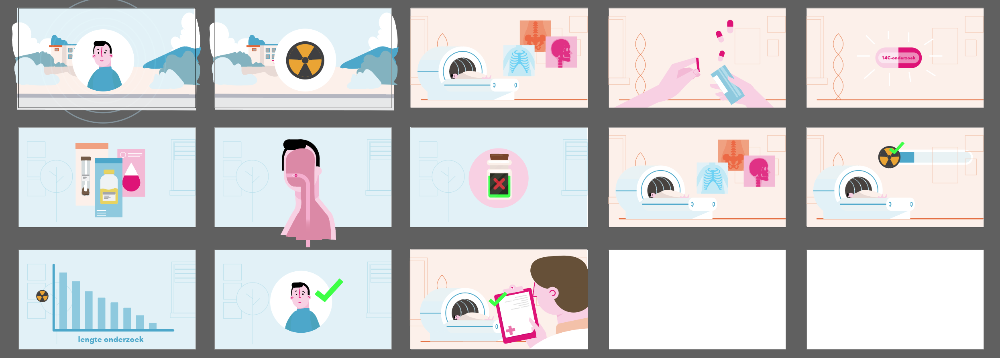

Wat betekent het nu als je een animatie laat maken van A tot Z? Om hier antwoord op te geven, gaan we in deze blog stapsgewijs door de fasen heen die je doorloopt bij het maken van een animatie. Uiteraard zijn deze fasen richtlijnen, maar afhankelijk van jouw specifieke situatie en wensen zal je de meeste fasen doorlopen of al doorlopen zijn.

Elke creatieve productie start met een idee of wens. Vervolgens kan je op zoek gaan naar een partij die jou kan helpen om deze animatie van A tot Z te realiseren. Het [maken van een animatie](https://www.philenflo.nl/oplossingen/animatie-laten-maken/) vraagt veel vakspecifieke kennis, het daarom aan te raden een gedegen partner te vinden die jou creatieve idee verder ontplooit en uitvoert. Samen met de specialist stel je technische kaders op om de doelen, tijdsframe en kosten van het project scherp te krijgen. Zodra dit rond is, is het tijd voor de creatieve invulling!

## Creatieve sessie voor een animatie 

Tijdens een creatieve sessie bespreek je met enkele betrokkenen de ideeën en wensen voor jouw animatie. Denk hierbij aan inspirerende voorbeelden die je met het team bekijkt, maar ook aan mooie voice-over stemmen, ideeën voor specifieke scenes, en kernwoorden die je belangrijk vindt om in het script terug te zien. Als je samenwerkt met een professionele partij, dan zullen zij jou de juiste vragen stellen om te komen tot de kern van jouw animatie.

## Script & Storyboard van een animatie 

Met alle input gaat een ervaren scriptschrijver aan de slag om jouw wensen te vertalen in een bondig, pakkend verhaal. Bij het maken van een script wordt al rekening gehouden met het beeld. Je vertelt je verhaal namelijk op twee manieren. Via beeld en via gesproken woord. Een goede samenhang tussen deze twee is van belang. Daarom schrijft de scriptschrijver niet alleen het gesproken script, maar ook in bondige zinnen wat er op beeld te zien is. Afhankelijk van hoe ingewikkeld of uitgebreid het onderwerp is, kan er zelfs gekozen worden om een storyboard te maken. In een storyboard staan afbeeldingen die een indicatie geven van wat er per scène te zien is. Dit helpt om een goed idee te krijgen bij de stijl van jouw animatie. Zodra de eerste versies van het script en eventuele storyboard af zijn, kan jij feedback geven. Zo kom je samen tot een definitief script.

## Animator aan het werk

Met het definitieve script en storyboard gaat de animator aan de slag. Elke scene wordt los opgebouwd en vervolgens samengevoegd tot één vloeiende animatie met een duidelijke call to action. Zodra de conceptversie van de animatie af is kan je feedback geven. Deze feedback spreek je door met je contactpersoon die zorg draagt dat alles goed netjes als mogelijk verwerkt wordt. Als dit naar wens gebeurd is, wordt de animatie definitief gemaakt.

## Succes boeken met animatie

Een animatie effectief inzetten vraagt om een goed contentplan waarin je je animaties, en andere content gefaseerd deelt met je publiek. Vaak heeft jouw contactpersoon hier gedegen advies over. Denk aan het inrichten van je socialmediakanalen, het ontwerpen van flyers met een qr-code of een teaserversie van je animatie. Met laatstgenoemde kan je effectief adverteren op bijvoorbeeld Linkedin en [Youtube](https://www.philenflo.nl/youtube-marketing/). Afhankelijk van wat jouw doelen zijn vind je samen met de experts de juiste tools om succes te boeken!

Dus wat betekent het om een animatie van A tot Z te laten maken? Eigenlijk wordt je geheel ontzorgd en hoef je alleen feedback of goedkeuring te geven op de gemaakte opzetten en producten die ervaren specialisten jou voorschotelen. Wil je meer weten over Animatie? Check hier alles over [2d animatie](https://www.philenflo.nl/2d-animatie/) en [3d animatie](https://www.philenflo.nl/3d-animatie-laten-maken/).