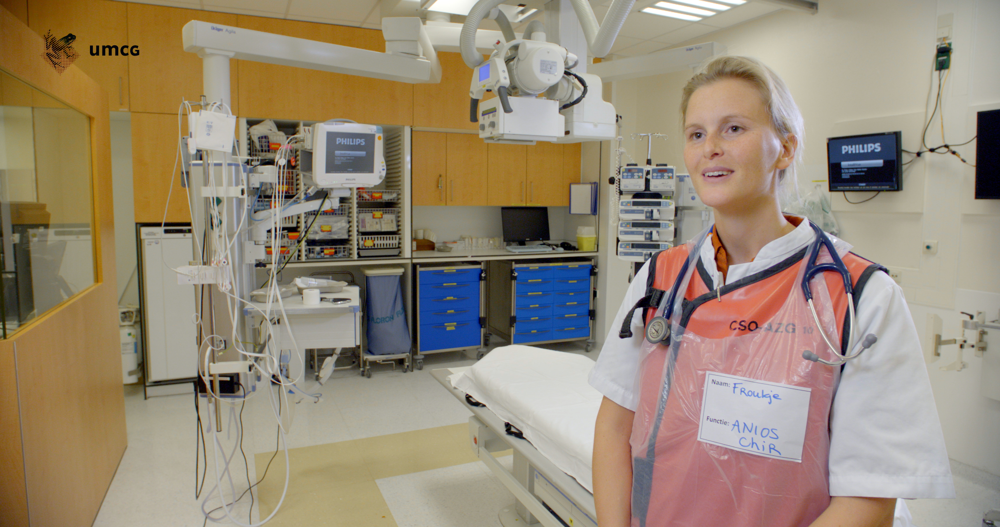
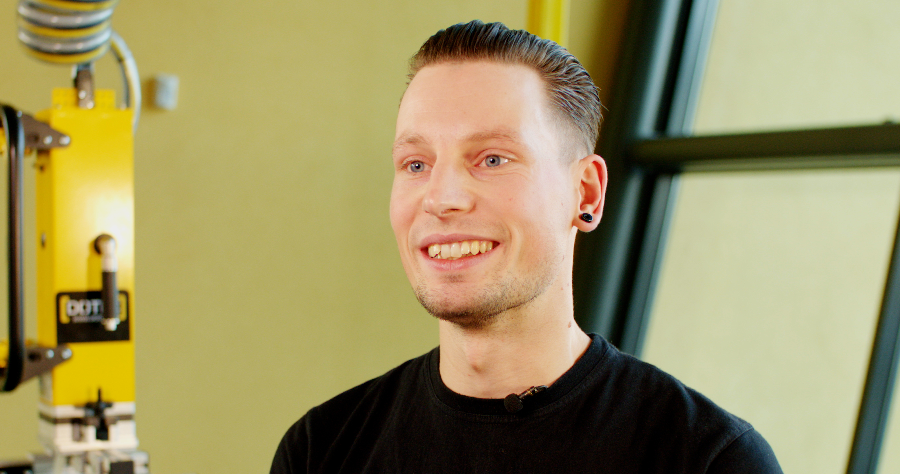

## Het nut van een employer branding video voor jouw bedrijf

Ben je op zoek naar een manier om nieuwe werknemers aan te trekken, kijk dan eens naar de mogelijkheid van employer branding videos. De laatste jaren zijn deze video’s meer en meer in opmars als wervingsinstrument. Er zijn dan ook steeds meer bedrijven die gebruik maken van deze manier om een vacature te promoten. Het is een handige en originele manier om mensen te interesseren voor een openstaande vacature, een video zegt veel meer dan een omschrijving op papier. Maar wat is nu eigenlijk een employer branding film?

## Wat is een employer branding video?

Een [employer branding video](https://www.philenflo.nl/oplossingen/employer-branding/) is in principe een video waarmee je een vacature binnen je bedrijf promoot voor potentiële werknemers. Gemotiveerde werknemers van jouw bedrijf vertellen over de sfeer in het bedrijf en de werkzaamheden. Verder geven ze vaak aan wat ze juist leuk vinden aan het bedrijf of de werkzaamheden. Op deze manier maak je meer indruk op potentiële kandidaten dan wanneer je alleen een online vacature plaatst. De toekomstige werknemer krijg een beter beeld van het bedrijf, de sfeer, eventuele toekomstige collega’s en de inhoud van de vacature. In de praktijk blijkt dat werkzoekenden eerder geneigd zijn om op vacatures te reageren met een employer branding film, dan te solliciteren op een vacature met droge tekst.

## Hoe maak je een employer branding video?

Zoals hierboven aangegeven wordt de video voor het grootste gedeelte ingevuld door je collega’s die iets vertellen over het bedrijf en de vacature. Het is verstandig om de interviewvragen van tevoren op te stellen, maar niet te delen met de collega’s die ze gaan beantwoorden. Dit zorgt ervoor dat de reacties spontaan en oprecht zijn. Het komt een stuk natuurlijker over als je werknemers zelf inhoud mogen geven aan de antwoorden op de vragen. Laat tijdens de video de verschillende collega’s zien die rond lopen, en aan het werk zijn binnen (en buiten) het bedrijf. Dit maakt het namelijk voor de sollicitatie een stuk makkelijker om vast te stellen of de bedrijfssfeer en de collega’s bij de sollicitant passen. Verder moet je er rekening mee houden dat de video niet te lang mag duren, streef ernaar om een video te maken van maximaal een minuut. Je zult versteld staan hoeveel je in een minuut kan laten zien en vertellen.

## Waarom kiezen voor het gebruik van een employer branding video?

Steeds meer bedrijven kiezen ervoor om een employer branding video te maken vanwege de vele voordelen die het biedt. Naast dat je betere kandidaten werft en eigenlijk de voorselectie vereenvoudigt, betrek je ook je eigen werknemers bij het proces. En zeg zelf? Hoor je liever van de baas of manager dat een bedrijf leuk is om bij te werken of van iemand die op de werkvloer aanwezig is? De kwaliteit van de aanmeldingen stijgt, wat weer tijd scheelt in het selectieproces.

Een andere reden om een employer branding video te maken is dat je meer sollicitaties binnen krijgt die aansluiten bij het bedrijf. Mensen die solliciteren na het zien van een [vacaturevideo](https://www.philenflo.nl/vacature-video/) hebben vaak ook een beter beeld van de inhoud van de vacature en het bedrijf waar ze solliciteren. Hierdoor kom je sneller in contact met de juiste kandidaat. 

Samengevat maakt een employer branding video het hele sollicitatieproces efficiënter.
Met behulp van een video kun je vaak ook complexe verhalen en bedrijfsprocessen sneller duidelijk maken dan via een tekst of gesproken woord. Wist je dat mensen bewegend beeld 60.000 keer sneller verwerken dan een tekst? De perfecte manier om jouw bedrijf te onderscheiden van de concurrent die nog met droge teksten personeel werft.

Nog niet overtuigd? Het plaatsen van een employer branding video is goed voor je SEO (Search Engine Optimalization). Hierdoor is je website en vacature makkelijker te vinden voor werkzoekende. Wil je liever wat anders? Dan kun je ook gaan voor een [bedrijfsvideo](https://www.philenflo.nl/bedrijfsvideo/). [Lees hier alles over het maken van een bedrijfsvideo](https://www.philenflo.nl/blog/bedrijfsfilm-laten-maken-van-a-tot-z/). Je kunt ook gaan voor een [virtuele employer branding tour](https://www.philenflo.nl/virtuele-tour-employer-branding/). 
Benieuwd hoe een employer branding jouw bedrijf en vacature op de kaart kan zetten? Vraag ons vrijblijvend naar de mogelijkheden!