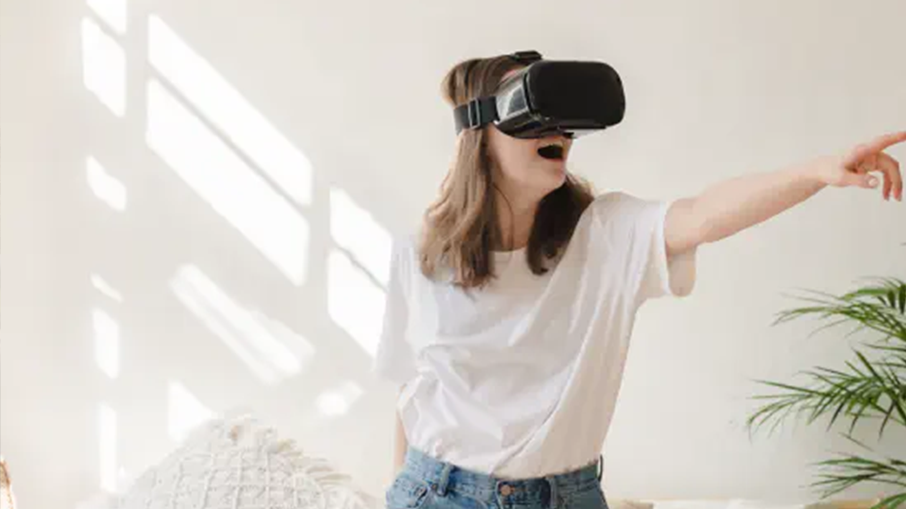

## Virtual reality inzetten voor jouw bedrijf

Meer bezoekers naar jouw showroom? Meer leads naar jouw website? Een verhoging in de omzet en waardering? Allemaal de resultaten van het inzetten van [virtual reality](https://www.philenflo.nl/oplossingen/virtual-reality/) in de marketingmix van jouw bedrijf. Bijvoorbeeld door een VR video. Dit wil jij natuurlijk ook. Maar hoe zet je het in? En vooral: waar begin je? Je leest het in dit blog.

## Waar staat Virtual Reality voor?

Virtual Reality (VR) is een kunstmatige, 3-dimensionale werkelijkheid gecreëerd door een computer.  Deze ‘virtuele realiteit’ reageert interactief op de gebruiker, door de beweging in een VR-bril, smartphone scherm, toetsenbord of computermuis. De kijker is compleet in controle van wat hij ziet.

## Hoe is virtual reality ontstaan?

Virtual Reality werd geïntroduceerd door internetpionier Jaron Lanier, dat met zijn bedrijf al in begin jaren tachtig experimenteerde met virtual reality technieken, en VR-systemen verkocht. Eerst alleen ingezet ten behoeve van het leger, NASA en de medische wereld, maar vanaf 1991 ook voor entertainment. De VR-technologie blijft groeien en zal alleen nog maar meer uitbreiden de komende jaren.

## Wat heb je nodig voor virtual reality?

Om echt te verdwalen in een virtuele werkelijkheid, heb je natuurlijk het juiste materiaal nodig. Zoals een VR-bril, VR-controllers (vergelijkbaar met die van de Xbox) en mogelijk een computer die de VR-bril ondersteund.

## Hoe maak je een virtual reality film?

Bij een virtual reality [video laten maken](https://www.philenflo.nl/oplossingen/video-laten-maken/), wordt gebruik gemaakt van zes camera’s met fisheye lenzen. Er ontstaan zes op zichzelf staande video’s die worden samengevoegd worden tot één. Klinkt heel makkelijk, maar alle kijklijnen moeten synchroon langs elkaar lopen. Een precies werkje, wat resulteert in een indrukwekkende film.

## Virtual reality film door Phil & Flo

Omdat virtual reality een zich blijft ontwikkelen, zijn de mogelijkheden nog lang niet uitgeput. Ben je geïnteresseerd geraakt in de mogelijkheden en ben je benieuwd hoe je dit voor jouw organisatie kan inzetten? Neem vrijblijvend [contact](https://www.philenflo.nl/contact/) op met een van onze experts.

