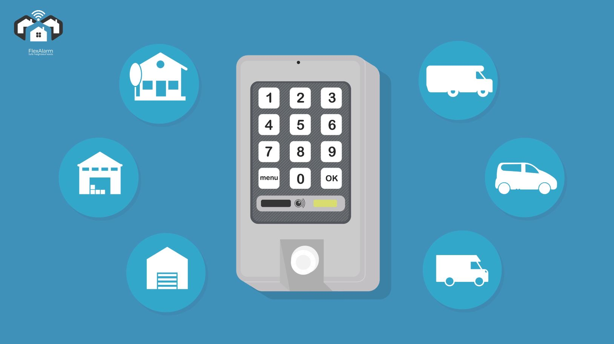
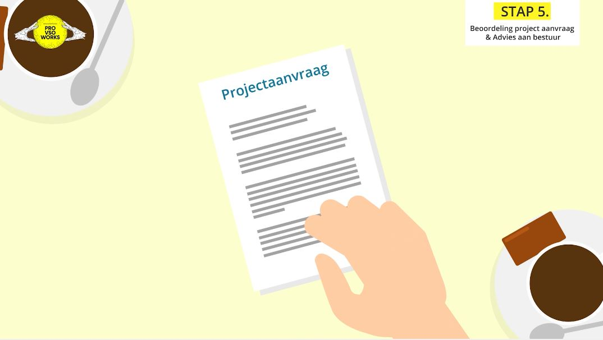

Je hoort vaak dat je als modern bedrijf niet meer zonder explainer video’s kunt. Dat klopt ook. Want met een goede [animatie](https://www.philenflo.nl/oplossingen/animatie-laten-maken/) verander je de wereld, vertel je verhalen, verkoop je producten en kun je in potentie iedere business vooruit helpen.

Maar wat zijn nu precies de beste manieren om animaties in te zetten? In dit blog leggen we uit wat explainer video's zijn en hoe je ze het best kunt gebruiken.

## First things first. Wat zijn explainer video's?

Een explainer video is - heel simpel - een korte video van ongeveer 1 à 2 minuten waarin je iets uitlegt.

Door middel van een [2D](https://www.philenflo.nl/2d-animatie/) of [3D animatie](https://www.philenflo.nl/3-d-animatie-laten-maken/), of juist een combinatie hiervan, voorzien van een goede [voice over](https://www.philenflo.nl/kennisbank/wat-is-een-voice-over/) wordt bijvoorbeeld een product, proces, probleem, je nieuwe app of de nieuwe naam voor je bedrijf uitgelegd. De toon is vaak lichtvoetig en informeel, maar dit hoeft natuurlijk niet. 

Begin met een goed verhaal. Dat is de basis. Met een verhaal raak je mensen. Niet te veel feiten of cijfers - want die vergeet je zo weer - maar verhalen, want die blijven hangen. En zijn een goede - misschien wel de beste - manier om informatie over te brengen.

### En wat is een explanimation?

Dat is een samenvoeging van explanation en animation en betekent eigenlijk hetzelfde, maar dan hipper verwoord. Overigens kom je ook vaak de term [uitleganimatie](https://www.philenflo.nl/uitleganimatie-laten-maken/) tegen.

### Waarom explainer video's?

Er zijn veel redenen om te investeren in een goede explanimation. De belangrijkste redenen zijn dat informatie die visueel wordt gebracht beter blijft hangen, beter wordt bekeken en het voor mensen makkelijker is om een video te bekijken dan om een tekst te lezen. In een animatie kan ook eenvoudig abstracte informatie of een complex proces worden gevisualiseerd. En video content is mobielvriendelijk en makkelijk te delen. 

Ook niet onbelangrijk: vergeleken met een live action video is een uitleganimatie eenvoudiger en goedkoper om te maken. Bovendien zijn ze makkelijk om later nog eens aan te passen.

In marketingtermen: Goed voor de brand engagement, om een boost aan je traffic te geven, de conversie te verhogen en een goede ROI.

## Hoe kun je een explanimation gebruiken?

Hieronder vind je een aantal manieren waarop je als bedrijf een explainer video in kunt zetten.
Een product, dienst of service uitleggen
De meest voorkomende explainer video's zijn die waarin een nieuw product, bedrijf, dienst of service wordt uitgelegd. Jouw klanten hebben een probleem, jij lost dat op met jouw product en met een explainer video maak je dat duidelijk aan de wereld. 

Één van de bekendste voorbeelden is dat van Dropbox. Met een simpele video op de homepage hebben zij hun conversie met 10% zien stijgen en daarmee 10 miljoen klanten binnengehaald en $48 miljoen mogen bijschrijven.*

\**(https://neilpatel.com/blog/dropbox-hacked-growth/)*

### Campagnes en het creëren van awareness op social media

Doordat video content zo makkelijk verspreid kan worden is video bij uitstek een medium voor het creëren van awareness. Rond een product of dienst, maar ook om problemen of gevoelige thema's aan te snijden.

Via de mogelijkheden die je hebt voor doelgroepsegmentatie is het makkelijk om je animatie aan de juiste ogen te laten zien. En als die het leuk vinden, is de video zo gedeeld.

Een andere manier waarop [explanimations](https://www.philenflo.nl/explanimation-laten-maken/) kunnen worden ingezet in campagnes, is via e-mail. Iets wat steeds vaker wordt gedaan. De gemiddelde werknemer op kantoor ontvangt ongeveer 100 e-mails per dag. De kans is groter dat een email beter wordt gelezen als die voorzien is van een explainer video.

### E-learning

In het onderwijs worden explainer video's toegepast als onderdeel van e-learning content. Bijvoorbeeld om informatie over te brengen en om de aandacht beter vast te houden en interactie met de lesstof te stimuleren. Animaties zijn bovendien makkelijk aan te passen of te wijzigen als de inhoud van de lessen verandert. Lees hier meer over [animatie inzetten binnen het onderwijs](https://www.philenflo.nl/blog/de-kracht-van-animatie-voor-het-onderwijs/). 

### Communicatie binnen het bedrijf

Er zijn verschillende manieren waarop de interne communicatie van een bedrijf gebaat kan zijn bij explainer video's.

#### Om iets aan te kondigen

Slaat jullie bedrijf een nieuwe weg in? Een nieuwe manier van uren schrijven of planningstool geïntroduceerd? Vertel het iedereen met een duidelijke animatie.

#### Nieuwe werknemers inwerken

Nieuwe werknemers direct goed op weg helpen is belangrijk. Met een video vertel je elke werknemer die binnenkomt hetzelfde verhaal en zorg je ervoor dat iedereen dezelfde ervaring én informatie heeft.

#### Training

Net zo als video een geschikt medium is om in te zetten in het onderwijs kan het ook goed gebruikt worden voor incompany training om nieuwe veiligheidsregels of bepaalde protocollen en processen te introduceren.

Bonus: De video's kunnen op eigen tempo en in eigen tempo worden bekeken. Zo vaak als iemand wil.

## Recruitment en employer branding

Of je klanten wilt binnenhalen of nieuwe medewerkers, de basisprincipes om mensen te overtuigen zijn hetzelfde. Net als potentiële klanten wil je nieuwe medewerkers niet vervelen met verkooppraatjes en clichématige teksten maar over de streep trekken met originele, relevante content.

In een explanimation kun je het bedrijf introduceren en de bedrijfscultuur toelichten. Zo weten nieuwe kandidaten waarom ze voor jullie bedrijf moeten kiezen en waar ze gaan solliciteren. Het is ook een manier om je als bedrijf te onderscheiden van andere bedrijven. De gemiddelde kandidaat leest honderden vacatureteksten dus als je de beste werknemers zoekt is een originele video een goede manier om op te vallen.

Andere manieren waarop een animatie kan worden gebruikt is om het sollicitatieproces te verduidelijken. 

### Ondersteuning van sales

Een offline salesgesprek kan lastig en vermoeiend zijn. Je wilt alle informatie over je product zo goed mogelijk naar voren brengen en bent tegelijkertijd bezig met het overtuigen van je gesprekspartners.

Door een explainer video in te zetten weet je zeker dat de belangrijkste boodschap goed overkomt en dat je altijd het juiste verhaal vertelt, op een heldere en begrijpelijke manier zodat er geen twijfel kan bestaan dat jouw product de beste oplossing is.

Een explanimation kan ook worden gebruikt als onderdeel van een aftersales strategie. Product verkocht? Stuur een video waarin het product wordt toegelicht en je de belangrijkste functies nog eens naar voren brengt.

### Nieuwsgierig geworden?

Heb je een goed idee voor een explanimation? Of ben je benieuwd naar onze ideeën? Neem contact op en we gaan samen kijken naar de mogelijkheden.