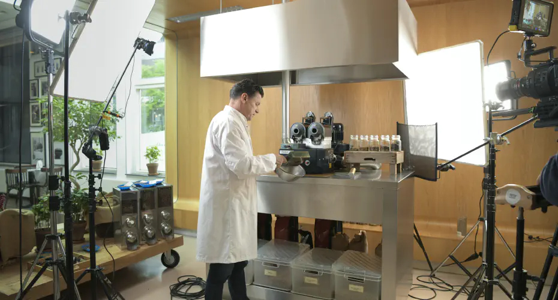

Conversie verhogen staat bij de meeste bedrijven hoog op de agenda. Als ondernemer wil je zo veel mogelijk klanten winnen. Diverse technieken worden ingezet om dit doel te bereiken. Eén manier die steeds populairder wordt, is het inzetten van een bedrijfsvideo. Benieuwd hoe jij jouw bedrijf hiermee naar een hoger niveau kan tillen? Wij vertellen je alles wat je moet weten over het belang van een goede bedrijfsvideo. Je zult zien dat ook jouw onderneming een verhoogde conversie kan ervaren door deze unieke tool in te zetten.

## Wat is een bedrijfsvideo?

Een [bedrijfsvideo](https://www.philenflo.nl/bedrijfsvideo/) is een uniek middel voor iedere onderneming om hun producten of diensten onder de aandacht te brengen bij de betreffende doelgroep. Het biedt jouw bedrijf bovendien de mogelijkheid om op te vallen en zich te onderscheiden van de concurrentie. Maar bereik je ook daadwerkelijk meer conversie dankzij een bedrijfsvideo?

## Is meer conversie dankzij een bedrijfsvideo mogelijk?

Binnen de online marketing wordt het begrip conversie veel gebruikt. Dit begrip doelt op het percentage van jouw website bezoekers dat ook daadwerkelijk klant wordt. Indien een bezoeker van jouw website een product koopt of tegen betaling gebruikmaakt van jouw diensten, heeft dit een positief effect op de conversie. Maar hoe zorg je er nu voor dat die conversie stijgt? Wat kun jij als ondernemer doen? Eén manier is het gebruik van [videomarketing](https://www.philenflo.nl/oplossingen/videomarketing/), bijvoorbeeld door een [bedrijfsfilm laten maken](https://www.philenflo.nl/bedrijfsfilm-laten-maken/).

Een goede bedrijfsfilm kan op den duur zorgen voor wel 80% meer conversie op jouw website. Middels een bedrijfsvideo kun je de bezoekers van jouw website op een persoonlijke manier overtuigen, en het biedt je bovendien de kans om een verpletterende indruk achter te laten. Je vertelt het verhaal van jouw bedrijf waarbij de normen, waarden en doelen van jouw onderneming duidelijk aan het licht komen.

Maar hoe creëer je nu een bedrijfsvideo die daadwerkelijk zorgt voor meer conversie? Een goede bedrijfsfilm dient wel aan een aantal voorwaarden te voldoen. Laat dit nu net ons specialisme zijn. Wij helpen je graag bij het creëren van een unieke bedrijfsvideo. Laten we kijken welke punten van belang zijn.

## Een sterke bedrijfsvideo voor meer conversie

Wanneer je eraan denkt om een bedrijfsvideo te laten maken, komen er ongetwijfeld veel vragen bij je naar boven. Om te beginnen zul je je waarschijnlijk afvragen wat er in een dergelijke video te zien en te horen moet zijn. Wij begrijpen dat het belangrijk is om een compleet en levendig beeld van jouw bedrijf te vormen. Hoe doen wij dit?

### Inspelen op emoties

Een bedrijfsvideo is effectief wanneer je inspeelt op de emoties van de kijker. Dit kan kan door gebruik te maken van diverse tactieken. Zo zetten wij bijvoorbeeld graag humor in. Dit zorgt niet alleen voor betrokkenheid van de kijker maar, vergroot bovendien de kans dat de video wordt gedeeld.

Ook [storytelling](https://www.philenflo.nl/blog/beste-voorbeelden-van-storytelling/) is een tactiek die goed werkt in een bedrijfsvideo. Zo kun je ervoor kiezen om personeel of klanten aan het woord te laten over jouw bedrijf. Op deze manier zijn nieuwe klanten eerder geneigd om de informatie ter harte te nemen.

Het bereiken van meer conversie met een bedrijfsvideo is dan ook grotendeels te danken aan het creëren van een emotionele connectie met jouw doelgroep. Lukt het je om een goed gevoel achter te laten bij jouw kijkers? Dan is de kans groot dat ze uiteindelijk voor jouw bedrijf kiezen.

### CTA

Verwerk eens een call-to-action (CTA) in een bedrijfsvideo. Soms heeft de klant immers een duwtje in de rug nodig, om te beseffen dat jouw bedrijf daadwerkelijk de beste keuze is. Dit doen we bijvoorbeeld door in te haken op de belangen van de doelgroep.

Ook moet duidelijk zijn welke stappen de klant moet nemen om eenvoudig gebruik te kunnen maken van jouw unieke producten of diensten. Zorg dus voor een korte en bondige video die toch haarfijn uitlegt welke vervolgstappen de consument dient te nemen.

### Op een creatieve manier uniek

Het maken van een bedrijfsvideo stelt jou als ondernemer in staat om op een creatieve manier te laten zien wat jouw bedrijf uniek maakt. Wat onderscheidt jou van de concurrent? Wat kan de klant verwachten wanneer deze kiest voor jouw dienstverlening? Door de antwoorden op deze vragen op een creatieve en toegankelijke manier op beeld vast te leggen, zal je merken dat dit de conversie van jouw website absoluut ten goede komt.

Ga jij voor een ingetogen video op locatie, of pak je uit door te filmen op verschillende locaties? En maak je nog gebruik van unieke filmmethode zoals bijvoorbeeld de inzet van een drone? De mogelijkheden zijn groots en er is voor ieder bedrijf een passende video te creëren.

Vind je het nog moeilijk om dit zelf vorm te geven? De professionals van Phil & Flo delen hun ervaring graag met jou. We werken graag met je samen om met elkaar een unieke video te maken die impact heeft en daadwerkelijk leidt tot meer conversie.

## Meer conversie met een bedrijfsvideo – Zelf maken of een professional inschakelen?

Meer conversie dankzij een bedrijfsvideo lijkt dus daadwerkelijk mogelijk. Dit heeft ook jou ongetwijfeld enthousiast gemaakt over het toevoegen van een bedrijfsfilm aan jouw website. Je kunt er natuurlijk voor kiezen om deze video zelf te maken, maar je kunt dit ook overlaten aan een professional.

Een professional zorgt ervoor dat er niets ontbreekt. En zorgt er natuurlijk ook voor dat gebruik wordt gemaakt van pakkende strategieën die de doelgroep weten te raken. Door Phil & Flo word je geheel ontzorgd en hoef je alleen feedback of goedkeuring te geven op de gemaakte concepten en scripts die onze experts aanleveren. Wil je meer weten over onze type films of werkwijzes? Lees meer over een[ video laten maken](https://www.philenflo.nl/oplossingen/video-laten-maken/) door Phil & Flo. Of [neem contact met ons op](https://www.philenflo.nl/contact/)!