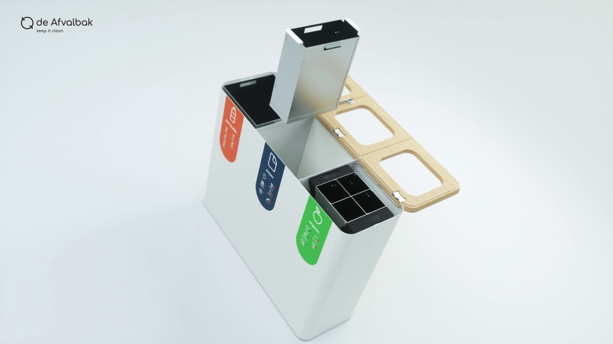

Productvideo's zijn niet langer meer leuk of nice-to-have, maar essentieel voor een succesvolle online verkoopstrategie. Wat is het nu precies waardoor productvideo's zo effectief zijn?

## Productvideo's werken conversieverhogend

Iedereen die online iets verkoopt weet het. Bezoekers naar je website krijgen is één, van die bezoekers betalende klanten maken is een tweede. Conversie, daar gaat het om. En die kan een flinke boost krijgen door het gebruik van productvideo's.

90% van de klanten geeft aan dat een video doorslaggevend is bij het maken van een aankoopbeslissing en 64% van de klanten is sneller geneigd om een product te kopen nadat ze een (product)video hebben bekeken.

Ook een interessante statistiek over het gebruik van video: 50% van de Generatie Z'ers en millennials geeft aan niet zonder video te kunnen.

## Productvideo's helpen bij het verbeteren van de klantervaring

De klantervaring (of customer experience) is de ervaring die je klant heeft met jouw bedrijf of merk. Je wilt dus je klanten een positieve klantervaring bieden. Offline, maar zeker ook online. 

Online betekent dit dat het proces van landen op de site tot de uiteindelijke conversie zo intuïtief en soepel mogelijk verloopt. De hele ervaring moet eigenlijk net zo natuurlijk aanvoelen als een winkel binnenstappen en iets kopen. 

Uit onderzoek van Google blijken twee interessante dingen over het gedrag van mensen die iets willen kopen. Tegenwoordig bekijkt 80% van de mensen een vorm van video wanneer ze meer informatie willen over een product. En tijdens hun onderzoek wisselen ze moeiteloos tussen Google, websites, [YouTube](https://www.philenflo.nl/you-tube-video-laten-maken/) en weer terug. 

Stel je voor dat iemand op zoek is naar een nieuwe hiking rugzak voor een wandelvakantie. Hij of zij gaat online zoeken naar informatie en vindt een paar veelbelovende rugzakken op een webshop voor outdoor artikelen. De volgende stap is waarschijnlijk een bezoekje aan YouTube of Facebook, om reviews van anderen te bekijken en meer te ontdekken over het product.

Om de ervaring te stroomlijnen en te vermijden dat mensen wegklikken, kun je het beste zelf die informatie aanbieden. Het beste is op je eigen website of productpagina, of in ieder geval op je eigen YouTube kanaal.

De klantervaring stopt overigens niet na de aankoop. Ook daarna kun je klanten nog positief beïnvloeden met een slimme video, bijvoorbeeld waarin je mensen bedankt voor de aankoop of waarin je tips geeft over het gebruik.

## De werking uitleggen

Ook al is iets online aanschaffen steeds gewoner - en bijna de norm - geworden, als het gaat om het verkopen van fysieke producten blijven er altijd een paar uitdagingen: hoe compenseer je het gebrek aan fysieke ervaring en menselijk contact dat je wel hebt in een winkel? Ook hier is het antwoord: Met een productvideo. Denk aan een [360 graden video](https://www.philenflo.nl/360-graden-video-laten-maken/), een [uitleganimatie](https://www.philenflo.nl/uitleganimatie-laten-maken/), een how-to video of demonstratievideo of screencaptures. 

In een video kun je laten zien hoe het product werkt, hoe het er in het echt uitziet en wat de belangrijkste functies zijn. Nog belangrijker, wanneer iemand iets voordoet, begrijpen we over het algemeen veel beter (en sneller) wat de bedoeling is dan wanneer we dit zelf uit moeten vinden aan de hand van een productomschrijving of specificaties. Dit geldt niet alleen voor fysieke producten. Ook wanneer je software of diensten aanbiedt, kun je gebaat zijn bij een productvideo. 

## Emotie en beleving

Nog even terug naar dat voorbeeld van die rugzak. Je kunt vertellen over de rugzak, dat je hem nauwelijks voelt als je door de bergen loopt met een prachtig uitzicht, terwijl je de frisse berglucht ruikt en met iedere stap dichter bij de top komt. Maar dit werkt dus een stuk beter wanneer je dit in beeld brengt. Combineer een goede boodschap met storytelling en die boodschap komt veel beter en sneller binnen.

## Productvideo's als social Proof

Professor Robert B. Cialdini, een invloedrijke Amerikaanse psycholoog, beschrijft in zijn boek 'The Psychology of Persuasion' 6 principes die kunnen helpen bij het overtuigen van mensen. De 6 principes worden overal bewust en onbewust toegepast. In onderlinge communicatie, maar ook door politici of marketeers die het gebruiken bij advertenties of op websites. Als je er een beetje op gaat letten zie je het overal terug.

Één van die principes is het principe van social proof. Dat gaat ervan uit dat mensen meer vertrouwen hebben in producten of diensten wanneer die worden aangeprezen door anderen. Het werkt het allerbest als die anderen zijn mensen op ons lijken en als we nog niet helemaal precies weten wat we precies zoeken. 

Er zijn verschillende manieren om dit met een productvideo in de praktijk te brengen: Door *user generated content* te plaatsen waarin mensen een review van je product opnemen, door influencers of andere bekende personen je product te laten aanprijzen. Of door experts aan het woord te laten.

## SEO

Hoewel zoekmachines (nog) geen video kunnen kijken, heeft de inzet van [video](https://www.philenflo.nl/oplossingen/video-laten-maken/) op een productpagina een aantal positieve effecten op de SEO. Tekst heeft nog altijd een streepje voor op video wanneer het gaat om SEO, maar een slimme combinatie werkt nóg beter. 

Je ranking gaat ervan omhoog. Bezoekers blijven bijvoorbeeld langer op de website waardoor het bouncepercentage omlaag gaat. En het kan ervoor zorgen dat je video als *rich snippet* in de zoekresultaten verschijnt met een thumbnail naast het zoekresultaat. Dit verhoogt de kans op een klik aanzienlijk.

Om dit voor elkaar te krijgen, is het belangrijk om wat aandacht te spenderen aan de optimalisatie van de video's. Dit doe je onder andere door belangrijke zoekwoorden te gebruiken in de titel en beschrijving van de video en te zorgen dat deze op een relevante pagina wordt geplaatst. Zo snapt Google de samenhang tussen de video en de rest van de content. Plaats je de video op YouTube, dan is het slim om het zoekwoord een paar keer te noemen tijdens de video. YouTube genereert automatische transscripts van video die (ook al kloppen ze niet altijd 100%) bijdragen aan een betere vindbaarheid. Nog beter: Plaats zelf een transcript.

## Social media

Wanneer heb je voor het laatst een productomschrijving gedeeld? En wanneer een video? Precies. Een video is ideaal om te delen. Zeker als de video leuk, grappig, interessant of opmerkelijk is. Het hoeft ook niet altijd serieus te zijn, maar laat de teugels een beetje vieren: Laat zien hoe het er achter de schermen aan toegaat bijvoorbeeld.

## De toekomst: Shoppable video

De laatste innovatie op het gebied van productvideo is shoppable video. Door video te combineren met interactieve elementen kun je vanuit de video meteen worden doorgeklikt naar een webshop of productpagina. 

Dit wordt nu al gedaan op social platforms als Instagram, Facebook en Snapchat. Maar bedrijven kunnen dit ook zelf doen op eigen platform of landingspagina. Van daaruit kunnen ze meer traffic naar achterliggende productpagina's genereren.

## Kunnen we jou helpen met een productvideo?

Dit zijn een paar voorbeelden die een productvideo heeft ten opzichte van tekst. We gaan graag in gesprek om te kijken hoe een productvideo jou kan helpen! [Neem contact op](https://www.philenflo.nl/contact/) of [plan een sessie in](https://www.philenflo.nl/30-minuten/).