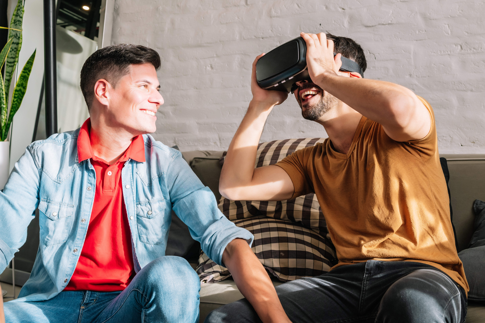
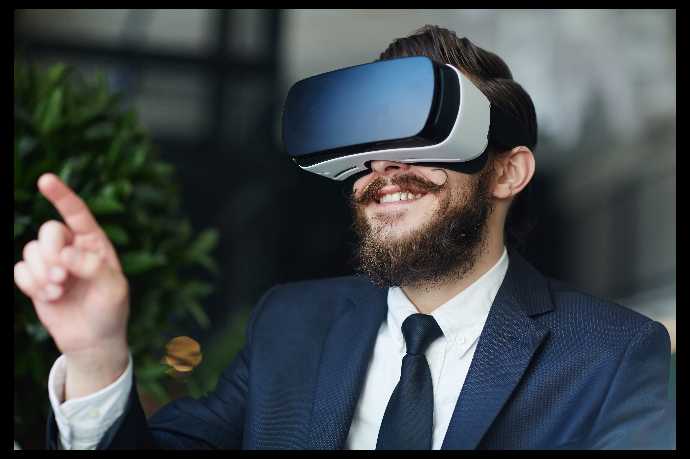
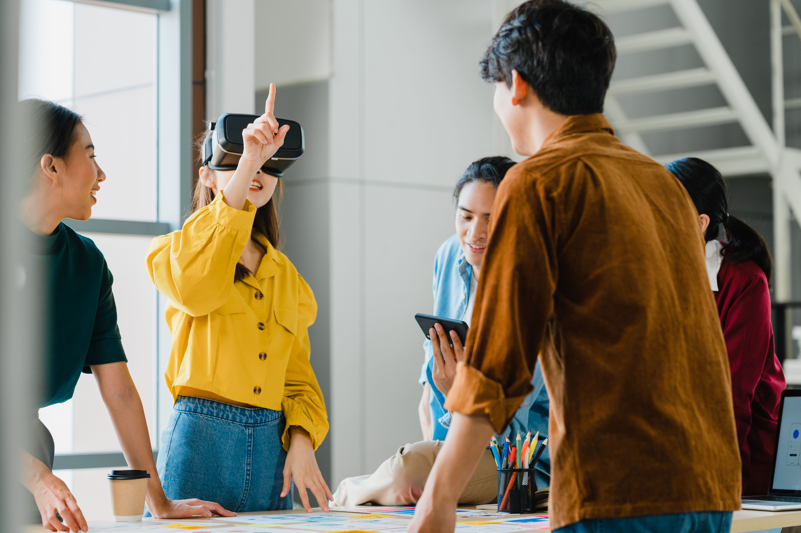

Door nieuwe ontwikkelingen ontstaan nieuwe kansen. Virtual reality is zo'n innovatie waar je veel over hoort en waar je als bedrijf in de toekomst misschien wel niet meer zonder kunt.

Virtual reality is de overtreffende trap van video. In plaats van kijker word je hoofdrolspeler en zelf onderdeel van het verhaal. Niet meer consumeren maar vooral beleven.

Als bedrijf kun je [virtual reality](https://www.philenflo.nl/oplossingen/virtual-reality/) op verschillende manieren gebruiken. Het wordt bovendien steeds eenvoudiger - en goedkoper - om virtual reality te ontwikkelen en steeds meer mensen beschikken over de mogelijkheden om virtual reality video’s te bekijken.

In dit artikel leggen we verder uit wat virtual reality is en kijken we naar de potentie hiervan voor verschillende bedrijven en sectoren. 

## Wat is virtual reality?

Eind jaren tachtig maakte de wereld voor het eerst kennis met de term virtual reality. De term werd destijds geïntroduceerd door Jaron Lenier, een internetpionier en oprichter van een bedrijf dat vroege VR-systemen verkocht. 

Eerder al werd er geëxperimenteerd met virtual reality achtige technieken maar virtual reality zoals we dat nu kennen - met een headset - bestaat ongeveer 35 jaar. 

### 360 graden foto/video

De simpelste toepassing van virtual reality is de [360 graden video](https://www.philenflo.nl/360-graden-video-laten-maken/)/foto. Het bekendste voorbeeld is de streetview functie in Google Maps.

### Augmented reality

Augmented reality (AR) is een variant op virtual reality. Augmented reality is het toevoegen van elementen aan de bestaande werkelijkheid. Met de VR-bril op of met je Smartphone zie je nog steeds je eigen omgeving maar met een extra interactieve laag eroverheen. Voorbeeldje? Pokemon Go. Of bepaalde filters in Snapchat. 

### Virtual reality

De vorm waar we hier op focussen is de volledig virtuele ervaring. Met een VR-bril op waan jezelf in een kunstmatige 3d-werkelijkheid. Die kan er realistisch uitzien of opgebouwd zijn als een geanimeerde fantasie wereld. Doordat de bril alle bewegingen registreert kun je 360 graden om je heen kijken en ben je vrij om in alle richtingen te bewegen. Zo ervaar je de 3d-omgeving als echt en kun je er ook aan deelnemen.

### Mixed reality

Nog een stap verder gaat mixed reality. Dit is een techniek die augmented reality en virtual reality combineert en waarbij de grens tussen werkelijkheid en realiteit bijna helemaal vervaagt. 

## Verschillende toepassingen van virtual reality

Je kunt je voorstellen dat dit alles oneindige creatieve mogelijkheden met zich mee brengt. Voor entertainment, games, in het [onderwijs](https://www.philenflo.nl/branches/onderwijs-kunst-cultuur/) of in de [zorg](https://www.philenflo.nl/branches/zorg-pharma/), maar ook voor allerlei soorten bedrijven. Een goed voorbeeld hiervan zijn de [interactieve schooltours](https://www.philenflo.nl/virtuele-school-rondleiding/).

Hier zijn een paar voorbeelden van toepassingen van virtual reality die interessant kunnen zijn.

### Virtuele tours

Je kunt je klanten laten zien hoe jullie nieuwe bedrijfspand eruitziet, en hem of haar meenemen door het kantoor en laten zien hoe het er bij jullie op kantoor aan toe gaat. Het kan ook interessant zijn om rondleidingen te geven in de fabriek en zo te laten zien hoe jullie productieproces in zijn werk gaat. Een mooie kennismaking. Ook leuk voor sollicitanten die alvast de sfeer in je bedrijf willen proeven. 

Virtuele tours en 360 graden video's worden ook veel gebruikt door makelaars en architecten. Denk dan aan de 360 tours in Funda en aan rondleidingen in een nog te bouwen huis of bedrijfspand.

### Productpresentatie en visualisaties

De kracht van virtual reality is dat het mensen helemaal kan meenemen in een andere wereld. Ideaal voor het presenteren van producten: Online, of in de winkel of op een beurs. Ook kunnen producten makkelijk worden gevisualiseerd, bijvoorbeeld een nieuwe keuken die je hebt laten ontworpen.

### Virtueel winkelen

Meerdere bedrijven hebben slimme toepassingen bedacht om het voor mensen makkelijk te maken om producten thuis uit te proberen. Ikea place bijvoorbeeld, een app om virtueel meubels uit te proberen, of Warby parker die een app heeft waarmee mensen brillen kunnen passen.

### Educatieve video's

Er zijn verschillende manieren te bedenken waarop VR kan ingezet worden in educatieve (bedrijfs-) video's. Er zijn al veel bedrijven die het gebruiken om medewerkers te trainen.

Voor het geven van veiligheidstrainingen, brandoefeningen of het toelichten van hygiëne protocollen. Voor het simuleren van klantgesprekken in een virtuele omgeving of het leren besturen van verschillende soorten voertuigen: van heftruck tot vliegtuig. In het onderwijs kun je denken aan toepassingen in de auto- en motortechniek maar ook voor medische opleidingen waarbij je in een virtuele video het menselijk lichaam uitlegt.

### Gezondheidszorg

Experts verwachten in de toekomst dat VR met name in de gezondheidszorg een enorme impact zal hebben. Nu al wordt virtual reality al op veel plekken succesvol gebruikt.

Als onderdeel van een behandeling zoals bij de behandeling van angststoornissen of virtuele fysiotherapie. En voor mensen die vanwege ziekte niet meer alles kunnen kan het worden gebruikt als ontspanning zodat mensen in een virtuele wereld tijdelijk een andere werkelijkheid kunnen ervaren waarin ze geen last hebben van de symptomen van hun ziekte. 

Een andere nuttige toepassing van virtual reality is om naasten te laten ervaren hoe het is om te leven met een psychose of te laten zien hoe de belevingswereld van iemand met dementie eruitziet.

## Voordelen van virtual reality video

De meerwaarde die virtual reality video biedt ten opzichte van reguliere video of animatie is de beleving. Door de toegevoegde laag van een 3d-werkelijkheid waarin je zelf de controle hebt kun je heel snel de echte werkelijkheid vergeten en voel je je helemaal onderdeel van een verhaal, product of activiteit. 

Dit leidt tot meer betrokkenheid van de klant, een unieke, gepersonaliseerde klantervaring en bij educatieve toepassingen een nog beter en efficiënter leerproces. 

Meer voordelen zijn besparing van tijd en geld. Het is locatieonafhankelijk. En bij educatieve toepassingen is het grote voordeel dat je kunt leren in je eigen tempo. Trainingen kunnen zo vaak mogelijk gedaan worden als nodig is zonder extra kosten te maken. Bonus: Het is veilig om in een virtuele omgeving fouten te maken.

## Meer weten over virtual reality?

Als je meer wilt weten over VR en de toepassing ervan? Neem dan contact met ons op en vraag een gratis en vrijblijvend gesprek aan.