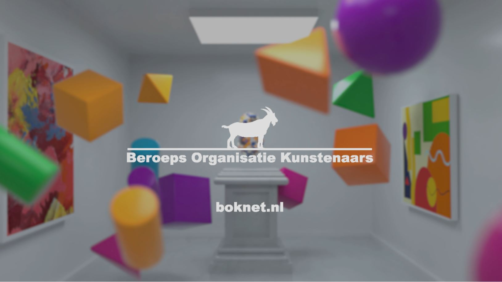

We leven in een tijd waarin merken vechten om onze aandacht. Content is overal en prikkels zijn zo alomtegenwoordig zijn dat de gemiddelde consument er haast immuun voor is geraakt. Tv [commercials](https://www.philenflo.nl/commercial-laten-maken/), prerolls, banners, social media ads. Allemaal voorbeelden van content waarmee je mensen eerder mee verveelt dan verleidt. Tel daar de komst van adblockers bij op en er ontstaat een echte uitdaging: Hoe bereik je consumenten in 2021? 

Branded content kan een oplossing zijn. Het vereist een iets andere manier van denken, maar als het goed toegepast wordt is het een effectieve manier om doelgroepen te blijven bereiken. 
Het zou zomaar kunnen dat het in de toekomst de norm wordt.

## Maar uh? Branded content?

Om gelijk de belangrijkste vraag van dit blog te beantwoorden. Wat is branded content nou eigenlijk? 

Branded content - of in goed Nederlands ‘gesponsorde content’ - is het maken of sponsoren van content om een connectie te maken met je consumenten.

In plaats van iets te promoten in andere content zoals bij een banner op een website of een preroll voor een andere video het geval is, is het een merk of bedrijf promoten door middel van zelfgemaakte content. De content is hierbij het belangrijkste en is vaak slechts zijdelings gerelateerd aan het merk of de producten die verkocht moeten worden. 

Branded content is eigenlijk een vorm van adverteren zonder te adverteren. De ervaring van de kijker is hierbij het belangrijkst. Die moet niet het gevoel hebben dat ze naar een reclame kijken maar naar iets wat ze juist graag willen zien.

En het is overigens verre van nieuw, denk aan de Tour de France die ooit is bedacht om meer kranten te verkopen, maar ook "dit weerbericht wordt mede mogelijk gemaakt door ...." is een vorm van branded content.

## Pijlers van branded content

Alhoewel er verschillende manieren zijn om branded content te maken herken je branded content aan een aantal gemeenschappelijke elementen.

### Content staat centraal

Waarbij in traditionele vormen van adverteren de focus ligt op producten en conversie, staat bij branded content - je raadt het al- de content centraal.

### Storytelling en emoties

Branded content wordt vaak gebracht op een verhalende manier, om zo emotie op te wekken in plaats van te overtuigen met feiten. Die emoties worden daarna automatisch geassocieerd met je merk wat ervoor zorgt dat je wordt onthouden. Zo bouw je een band op met je klanten. Lees hier meer over [storytelling](https://www.philenflo.nl/blog/beste-voorbeelden-van-storytelling/). 

### Informeren, entertainen of een statement maken

Branded videos kunnen met verschillende doelen worden gemaakt. Om informatie over te brengen, als entertainment, of om als bedrijf een statement te maken. En waar bedrijven dat laatste vroeger probeerden te vermijden wordt het door nieuwe generaties consumenten steeds meer gewaardeerd als een bedrijf laat zien waar ze staan in een bepaalde discussie.

### Waarden in plaats van producten

In plaats van producten staan de waarden van een merk centraal. Een subtiel maar belangrijk verschil. 

### Toegevoegde waarde bieden

In plaats van in te breken op een bepaalde ervaring (het bekijken van een video, het lezen van een website) biedt branded content toegevoegde waarde. Het is content die aansluit bij de interesses van mensen of waar ze iets aan hebben. Of content die ze leuk vinden en graag willen bekijken. 

### Wees jezelf

Het wordt gewaardeerd als je een statement maakt, maar wees authentiek en eerlijk. Blijf dicht bij jezelf.

### Makkelijk te verspreiden

Branded content video's kunnen makkelijk worden verspreid. Op je eigen website, maar ook op social media of het [YouTube](https://www.philenflo.nl/you-tube-video-laten-maken/) kanaal van je bedrijf. Zo kan een goede campagne ook makkelijk viraal gaan doordat mensen het willen delen.

### Vaak geen CTA

Het gaat tegen de intuïtie van veel marketeers in, maar bij branded video's is het de bedoeling om de Call To Action achterwege te laten. Hiermee benadruk je alsnog dat het 'alleen maar om de sales gaat'. En dat is nou net wat je probeert te vermijden. Wel kun je na de video bijvoorbeeld een logo tonen zodat toch duidelijk is wie de afzender is.

## Voorbeelden van branded content

Nog een beetje abstract? Tijd voor wat voorbeelden.

### For once, Don’t Do It | Nike

Een goed voorbeeld van branded content waarbij een krachtig statement wordt gemaakt is dat van Nike. In de "For once don't do it" campagne, vier dagen na de dood van George Floyd gelanceerd, gebruiken ze hun eigen slogan om zich uit te spreken tegen racisme en voor de #blacklivesmatter beweging.



### Dove





Een ander voorbeeld van een bedrijf wat niet bang is om een sociaal statement te maken is Dove. Een aantal jaar geleden al met de "You Are More Beautiful Than You Think" campagne. En tijdens de corona crisis opnieuw met een video met als thema "Courage is beautiful". In de video wordt dit mooi gevisualiseerd door beelden van hulpverleners te laten zien die striemen in het gezicht hebben van het dagenlang dragen van mondmaskers. 

### Klusfilmpjes en product reviews





Dichter bij huis zijn bedrijven zoals Gamma en Coolblue goed bezig. De eerste met klusfilmpjes met uitleg over hoe je bijvoorbeeld een muur streeploos verft of hoe zelf je huis kunt isoleren. Coolblue doet iets vergelijkbaars en gebruikt[ productvideos](https://www.philenflo.nl/3d-productvideo/) om producten te reviewen of uit te leggen.

### LEGO the movie



LEGO, een bedrijf wat als geen ander last heeft van de digitalisering, doordat het veel concurrentie heeft van games, YouTube en Betflix, heeft zichzelf in 2014 opnieuw op de kaart gezet met de film "Lego The Movie". Misschien wel één van de succesvolste voorbeelden van branded content.

Een succesvolle (gemaakt met een miljoenenbudget) film die gaat over een antiheld die succesvol de strijd aangaat met een evil genius die de wereld wil vernietigen. Samen met allerhande LEGO poppetjes (Batman) en met een sterrencast van stemmen. De film was een hit bij jong, en oud (ook niet onbelangrijk, die moeten vaak de LEGO betalen).  Na release van de film zijn de verkopen met 25% gestegen. 

## Aan de slag met branded video content?

Wij kunnen je helpen en brainstormen graag eens met je over wat er allemaal mogelijk is voor jou of je bedrijf. Neem contact op en we gaan zo snel mogelijk aan de slag!